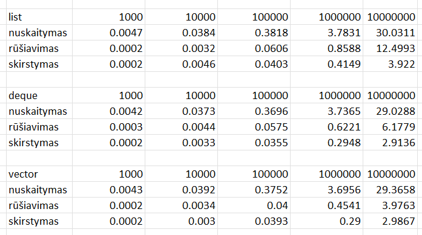
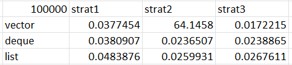

# v1.0 pradinis

##### Sistemos parametrai:

* CPU: AMD Ryzen 5 5500U
* RAM: 16GB
* SSD: SAMSUNG 256 GB

##### Testavimo rezultatai:

* Kiekvienam konteinerių tipui bei įrašų skaičiui testavimas atliktas 3 kartus (rodomi vidurkiai)
* Kiekvienam testavimo atvejui naudojami tie patys .txt failai (1000, 10000 ir t.t.)
* Lentelėje laikai rodomi sekundėmis
* Visi testai atlikti su -O2

# v1.0 galutinis

* Kiekvienam konteinerių tipui (100k įrašų sk.) testavimas atliktas 3 kartus (rodomi vidurkiai)
* Kiekvienam testavimo atvejui naudojamas tas pats .txt failas (100k)
* 3 strategijoje vectoriui implementuotas "std::partition", o list ir deque - naudojama ta pati 2 strategija (stl funkcijos tik padidino skirstymo laiką)

## Naudojimas

* Nukopijuokite testinius .txt failus į darbo folderį
* main.cpp faile galima pasirinkti konteinerio tipą (vector, list, deque) komentuojant / atkomentuojant atitinkamą eilutę
* Menu pasirinkimai: 1 - sugeneruoti failus iš kurių skaitoma, 2 - nuskaityti, rūšiuoti, skirstyti į grupes (matuoti laikus), 3 - exit
* Programoje konsolėje bus atspausdinti laiko matavimai kiekvienai strategijai

## CMake instrukcija

mkdir build

cd build

cmake ..

cmake --build .

./darbas1

